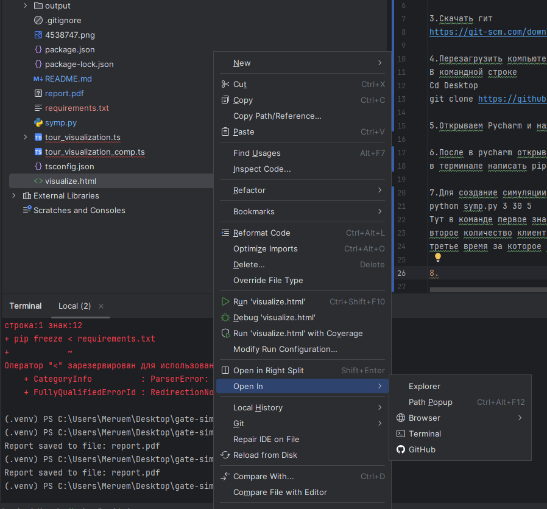

1.Скачать python
https://www.python.org/downloads/

2.Скачать pycharm
https://www.jetbrains.com/pycharm/download/?section=windows

3.Скачать гит
https://git-scm.com/downloads

4.Перезагрузить компьютер и клонировать репозиторий
В командной строке 
Cd Desktop
git clone https://github.com/mqxl/tourist-simulator.git

5.Открываем Pycharm и нажимаем там open и открываем проект который мы скачали с гитхаба

6.После в pycharm открываем терминал(alt + f12) и скачиваем зависимости
в терминале написать pip install -r requirements.txt

7.Для создание симуляции
python symp.py 3 30 5 
Тут в команде первое значение это количество столов
второе количество клиентов
третье время за которое один стол отрабатывает одного клиента

8.После нажимаем правой кнопкой мыши на файл visualize.html

И нажимаем браузер и открываем в удобном для нас браузере
и нажимаем кнопку старт для визуализации
